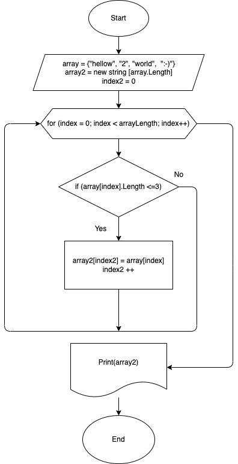

# Задание:

Написать программу, которая из имеющегося массива строк формирует массив из строк, длина которых меньше либо равна 3. 
Первоначальный массив можно ввести с клавиатуры, либо задать на старте выполнения алгоритма. При решении не рекомендуется пользоваться коллекциями, лучше обойтись исключительно массивами.

# Решение задачи: 

## 1-й Этап 
Для того, чтобы выполнить решение данной задачи, составим алгоритм. В алгоритме опишем процесс отбора строк, длина которых меньше либо равна 3. 

Выводом для алгоритма будет отдельно написанный метод PrintArray, который выводит новый массив с отобранными строками.

## 2-й Этап 

Написание кода. 

1. Создаем два массива типа string: array, array2. 
Первый массив вручную заполняем необходимыми элементами (строками). Второй создаем пустым. Длину задаем равную длине первого массива (на случай если все строки удовлетворяют требованию).

2. Для того, чтобы вывести новый массив (array2) с отобранными элементами (строками), создадим метод PrintArray, который будет выводить данные на консоль. 

3. Последним шагом мы опишем процесс отбора необходимых нам строк (число элементов которых меньше либо равно 3) и их запись в ячейки массива array2. 

4. С помощью описанного нами метода Print Array, выведем наш массив array2 на консоль. 

